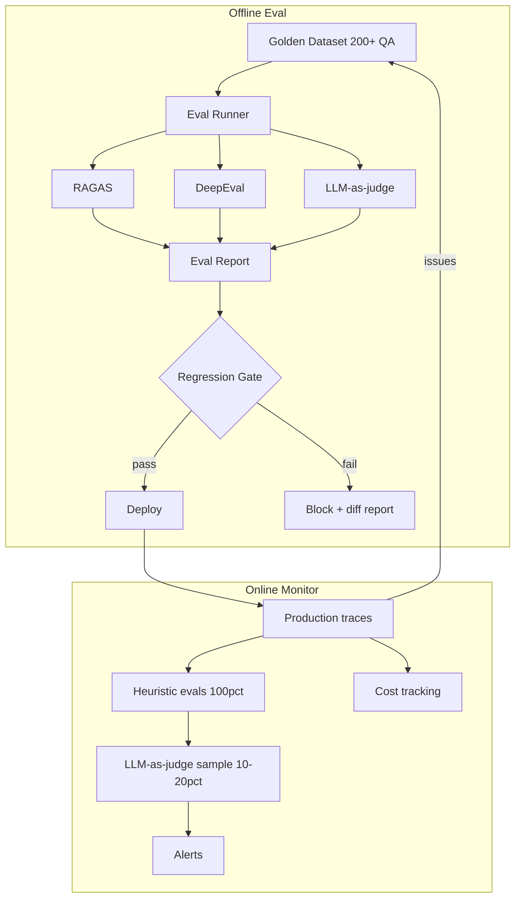

# LLM Evals Platform

[](https://github.com/nlpcvvoice/llm-evals-platform/actions/workflows/test.yml)

A production-grade **evaluation and monitoring platform** for RAG/Agent systems.
It gives LLM teams measurable quality gates, regression protection, and
production observability — turning a one-off LLM demo into a system you can
trust and maintain.

## Why

Most AI teams can demo an LLM once; few can prove it _stays good_. This platform
closes that gap with three layers of evaluation and a two-state monitoring loop.

## Architecture



## Getting Started

### Prerequisites

- Python 3.11+
- OpenRouter API key (free models, see `config.py`)

### Setup

```bash
python3.11 -m venv .venv
source .venv/bin/activate
pip install -e ".[dev]"
cp .env.example .env   # non-sensitive config; API key loads from shared env
```

### Run tests

```bash
pytest
```

## Project Layout

```
src/llm_evals/
├── eval/        # offline evaluation (RAGAS, DeepEval, LLM-as-judge)
├── monitor/     # production monitoring & observability
└── api/         # FastAPI service
```

## Skills Used

> Active skills — updated incrementally as the project progresses.

| Category | Skill | Where implemented |
|----------|-------|-------------------|
| **LLM Engineering** | Multi-model routing & automatic fallback rotation | `llm.py` |
| | Cost control: enforced `:free`-only model policy | `config.py: assert_free_only` |
| | OpenAI-compatible provider abstraction (OpenRouter) | `llm.py` |
| | Guardrail: secret key never logged, presence-only reporting | `config.py` |
| **Evaluation & Quality** | Golden dataset design (QAItem schema, versioned JSONL) | `eval/data.py` |
| | Strict data validation (id/question/answer/limits/eval-kinds) | `eval/validation.py` |
| | Dataset loading, sampling, and statistics | `eval/dataset.py` |
| **Infrastructure & Engineering** | Python `src/` layout + dependency pinning (`pyproject.toml`) | repo root |
| | Type safety (mypy, zero errors) | all modules |
| | Linting (ruff, zero issues) | all modules |
| | CI/CD on GitHub Actions (ruff + mypy + pytest) | `.github/workflows/` |
| | Test-driven development (23 unit tests) | `tests/` |
| **Status badge** | Automated CI status in README | header above |

## Roadmap

- [x] Golden dataset scaffold (QAItem schema, loader, validator, CLI, seed data)
- [ ] Golden dataset (200+ QA full coverage)
- [ ] Three-layer offline evaluation (Eval Runner, RAGAS, DeepEval, LLM-as-judge)
- [ ] Regression gate + CI integration
- [ ] Production monitoring & drift detection
- [ ] Cost & latency tracking

## License

MIT
