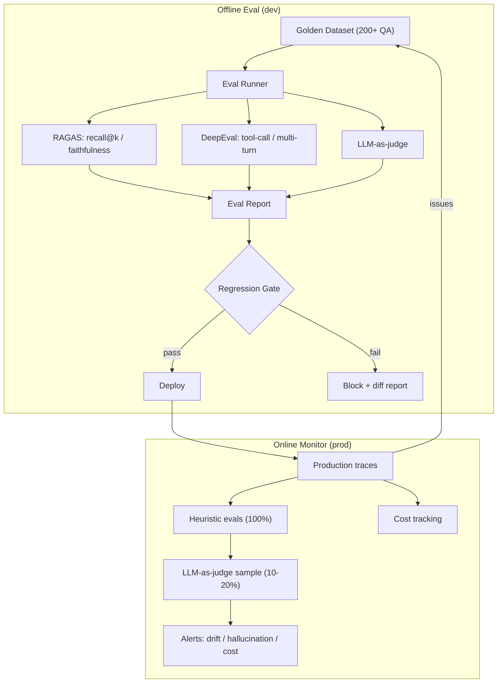

# LLM Evals Platform

A production-grade **evaluation and monitoring platform** for RAG/Agent systems.
It gives LLM teams measurable quality gates, regression protection, and
production observability — turning a one-off LLM demo into a system you can
trust and maintain.

## Why

Most AI teams can demo an LLM once; few can prove it _stays good_. This platform
closes that gap with three layers of evaluation and a two-state monitoring loop.

## Architecture



## Getting Started

### Prerequisites

- Python 3.11+
- OpenAI API key (for `LLM-as-judge` and provider calls)
- LangSmith API key (optional, for tracing)

### Setup

```bash
python3.11 -m venv .venv
source .venv/bin/activate
pip install -e ".[dev]"
cp .env.example .env   # then fill in your keys
```

### Run tests

```bash
pytest
```

## Project Layout

```
src/llm_evals/
├── eval/        # offline evaluation (RAGAS, DeepEval, LLM-as-judge)
├── monitor/     # production monitoring & observability
└── api/         # FastAPI service
```

## Roadmap

- [ ] Golden dataset builder (200+ QA)
- [ ] Three-layer offline evaluation
- [ ] Regression gate + CI integration
- [ ] Production monitoring & drift detection
- [ ] Cost & latency tracking

## License

MIT
